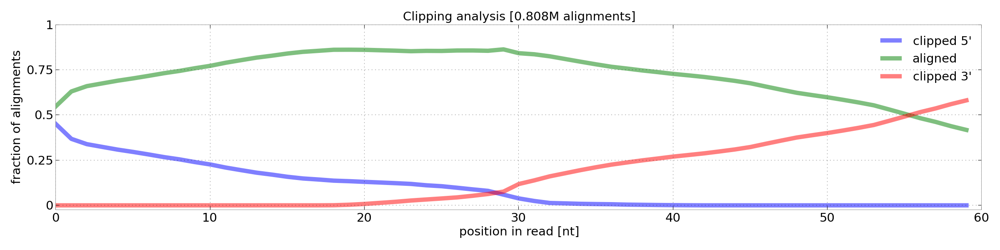

**********************************
Methods
**********************************

.. _3protocols:

3' end sequencing protocols
===========================

apa-db.org supports several 3' end sequencing protocols. After read pre-processing and alignment to the reference, the main difference between
these protocols is in determining the cleavage site loci and in further filtering steps (see below).

====================================== ================================ ===================
Protocol                               Cleavage site                    Read attributes
====================================== ================================ ===================
pAseq, Wang et al., unpublished        3'-end nucleotide of alignment   A rich at 3'-end
Lexogen 3' forward                     3'-end nucleotide of alignment   A rich at 3'-end
Lexogen 3' reverse                     5'-end nucleotide of alignment   T rich at 5'-end
====================================== ================================ ===================

.. _r_bedgraph_method:

Mapping of reads to the reference genome
========================================

Reads mapping (alignment) to the appropriate reference genome (hg19, mm10, etc.) is done with `STAR <https://github.com/alexdobin/STAR/releases>`_.
No special preprocessing other than quality control is performed. `STAR <https://github.com/alexdobin/STAR/releases>`_ is run allowing 5' and 3' soft clipping:
the potential poly-A tail (poly-T in some protocols) is soft-clipped from the read, allowing a more accurate identification of cleavage sites compared
to pre-processing and removing A/T rich 3'/5' ends of reads prior to mapping.

  Clipping analysis of aligned reads. Green line shows percentage of aligned nucleotides at specific position, blue line clipping from 5' end of reads and red line clipping from 3' end of reads.

R (raw, unfiltered) bedGraph
============================

The raw :ref:`bedGraph <r_bedgraph_format>` sites file, constructed by providing one site loci per alignment. This information is extracted from the bam file.
The sites loci are determined based on :ref:`protocol <3protocols>` (5' or 3' end of alignment). Files are stored in:

.. code-block:: bash

 ${data_folder}/${lib_id}/e${exp_id}/m${map_id}/lib_id_e${exp_id}_m${map_id}.T.bg

T (tail, filtered) bedGraph
===========================
The tail :ref:`bedGraph <r_bedgraph_format>` sites file. The filtering depends on the protocol (see below).

pA-seq (Wang et al.)
#################################

Lexogen 3' forward
######################

This protocol produces A-rich reads at the 3'-end of the sequence. The assignment of the cleavage site loci is as follows:

#. set the CS site as the last (3' end) nucleotide of the mapped read (alignment)
#. if the last 20nt of the alignment is A-rich (#A>10), skip it (genomic priming)

Finally, construct the APA local-atlas from the CS-loci.

Lexogen 3' reverse
######################

This protocol produces T-rich reads at the 5'-end of the sequence. The assignment of the cleavage site loci is as follows:

#. set the CS site as the first (5' end) nucleotide of the mapped read (alignment)
#. if the first 20nt of the alignment is T-rich (#T>10), skip it (genomic priming)

Finally, construct the APA local-atlas from the CS-loci.

Local poly-A atlas (database)
===========================

Before computing expression files, we define local groups of experiments (usually every library has it's own poly-A atlas). The atlas definition file is stored in:

.. code-block:: bash

  ${polya_folder}/${lib_id}.config

This config file contains the experiment identifiers, e.g.:

.. code-block:: bash

  elib_e1
  elib_e2
  elib_e3
  ...

We group together T bedGraph files from the defined experiments (in this example e1, e2, e3 and e4) and:

#. create sorted loci list (reverse order = most expressed loci at the top)
#. select first loci in the list and remove all surrounding loci in region [-125, 125]
#. store selected loci in the atlas and remove it from the list
#. repeat previous two steps until loci list is empty

E (expression) bedGraph
===========================

For a given poly-A atlas and experiment R file, compute:

#. sum up experiment R file in region [-100, 25] for each poly-A atlas loci
