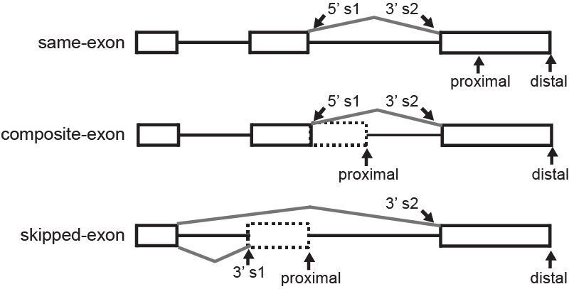

.. _apacat:

APA categories
--------------
Once we determine the 2 polyA sites of interest (**proximal** and **distal**) for each gene, we divide the analysis in 3 categories based on the polyA site pair position:

The APA proximal/distal categories are:

#. same-exon: the 2 polyA sites are in the same exon
#. composite-exon: the proximal site is annotated to the intron
#. skipped-exon: the proximal site is in another exon compared to the distal site

We also show the **splice-site 1 (s1)** and **splice-site 2 (s2)** positions relative to the proximal and distal sites.

These 4 loci in each gene (proximal, distal, splice-site 1, splice-site 2) are used to draw :ref:`RNA-maps <rnamap>`.
