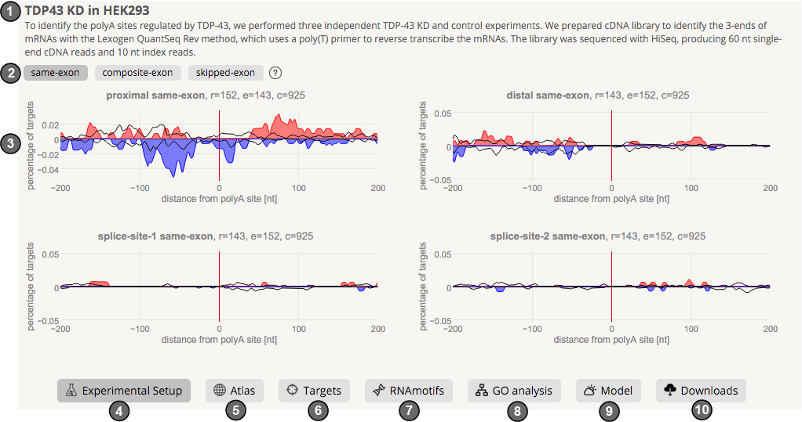

Using the web application
-------------------------
The main menu on the top right in the browser is your basic navigation point in apaExpress.

#. Search allows you to find and view comparisons in apaExpress
#. Help opens this documentation
#. About provides some compact information about apaExpress research platform, it's use and contributors
#. Sign-in provides the possibility to login with your existing Google account for accessing un-published data on our servers at **apaexpress.org**. We do not store any information or get access to any of your Google account details

Search menu
===========
This is the main interface to find and interact with apaExpress analysis results. Currently, the main search is for :ref:`comparisons <comps>`.

.. _comps:

Comparisons
===========
The comparison is performed between a set of test experiments against a set of control experiments, with the goal of identifying alternatively polyadenylated genes
and drawing RNA-maps.

#. Name and short description of comparison
#. Separately consider :ref:`3 categories of APA <apacat>`: same-exon, combined-exon and skipped-exon
#. :ref:`RNA-map <rnamap>` of proximal (left) / distal (right) polyA sites and :ref:`splice-site 1 and 2 <apacat>` (below)
#. Experimental setup: information about the included experiments (in test and control sets)
#. Atlas: statistics of number of polyA sites considered, their loci and expression over all data combined
#. Targets: shows targets (genes on which the protein of interest is binding) in heatmaps
#. RNAmotifs: results of RNAmotifs analysis in 3 regions up/down of regulated polyA sites
#. :ref:`GO analysis <go>`: GO-term enrichment analysis of regulated target genes
#. Model: predictive modeling of polyA site usage with random forests and SVM
#. Downloads: several files containing information about polyA site loci, gene expression etc;
