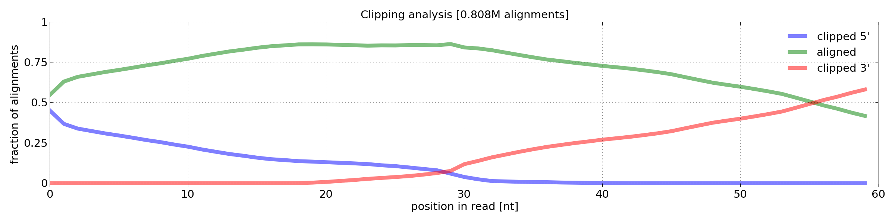

============================
**apa** (python) software manual
============================

-----------
Quick start
-----------

A quick start example to show you how to use the platform to process your data.

Dependencies
-------------------------------

This list of software needs to be installed and in your path to run the analysis:

.. code-block:: bash

  # STAR short-read aligner
  git clone https://github.com/alexdobin/STAR.git  # clone GitHub STAR repository
  export PATH=$PATH:STAR/bin/Linux_x86_64          # add the correct STAR binary to your PATH (in this example Linux_x86_64)

  # pybio genomic analysis
  git clone https://github.com/grexor/pybio.git pybio   # clone pybio repository
  export PATH=$PATH:pybio/bin                           # add pybio/bin to PATH

Download example library and annotation
-------------------------------
Experiments are organized in libraries. For this example we will call our library example_lib, containing 4 experiments (with id 1, 2, 3 and 4).

To download the example library (elib) with 4 experiments (id 1,2,3 and 4), move to your ${data_folder} (by default data.apa) and run wget:

.. code-block:: bash

  wget http://www.apa-db.org/example . -R

This will download the experiment FASTQ files (one file per experiment) and the annotation file to your ${data_folder}:

.. code-block:: bash

  ${data_folder}/example_lib/annotation.tab # annotation file
  ${data_folder}/elib/e1/elib_e1.fastq.gz   # FASTQ experiment 1
  ${data_folder}/elib/e2/elib_e2.fastq.gz   # FASTQ experiment 2
  ${data_folder}/elib/e3/elib_e3.fastq.gz   # FASTQ experiment 3
  ${data_folder}/elib/e4/elib_e4.fastq.gz   # FASTQ experiment 4

Check annotation.tab:

====== ======= === ====== ======= ======= ======
exp_id method  rep tissue cond    species map_to
====== ======= === ====== ======= ======= ======
1      lex_fwd 1   HeLa   control Hs      hg19
2      lex_fwd 2   HeLa   control Hs      hg19
3      lex_fwd 1   HeLa   test    Hs      hg19
4      lex_fwd 2   HeLa   test    Hs      hg19
====== ======= === ====== ======= ======= ======

It contains 4 experiments, 2x test and 2x control, from HeLa cells.

Map reads to reference genome (hg19)
------------------------------------

Genomic data processing is done with pybio. Download and setup the hg19 reference genome and Ensemble annotation:

.. code-block:: bash

  cd pybio/genomes     # cd to genomes folder
  ./hg19.download.sh   # download hg19 assembly and Ensembl annotation, build STAR indices

-------
Methods
-------

.. _3protocols:

3' end sequencing protocols
-------------------------------

apa-db.org supports several 3' end sequencing protocols. After read pre-processing and alignment to the reference, the main difference between
these protocols is in determining the cleavage site loci and in further filtering steps (see below).

====================================== ================================ ===================
Protocol                               Cleavage site                    Read attributes
====================================== ================================ ===================
pAseq, Wang et al., unpublished        3'-end nucleotide of alignment   A rich at 3'-end
Lexogen 3' forward                     3'-end nucleotide of alignment   A rich at 3'-end
Lexogen 3' reverse                     5'-end nucleotide of alignment   T rich at 5'-end
====================================== ================================ ===================

.. _r_bedgraph_method:

Mapping of reads to the reference genome
-------------------------------

Reads mapping (alignment) to the appropriate reference genome (hg19, mm10, etc.) is done with `STAR <https://github.com/alexdobin/STAR/releases>`_.
No special preprocessing other than quality control is performed. `STAR <https://github.com/alexdobin/STAR/releases>`_ is run allowing 5' and 3' soft clipping:
the potential poly-A tail (poly-T in some protocols) is soft-clipped from the read, allowing a more accurate identification of cleavage sites compared
to pre-processing and removing A/T rich 3'/5' ends of reads prior to mapping.

  Clipping analysis of aligned reads. Green line shows percentage of aligned nucleotides at specific position, blue line clipping from 5' end of reads and red line clipping from 3' end of reads.

R (raw, unfiltered) bedGraph
-------------------------------

The raw :ref:`bedGraph <r_bedgraph_format>` sites file, constructed by providing one site loci per alignment. This information is extracted from the bam file.
The sites loci are determined based on :ref:`protocol <3protocols>` (5' or 3' end of alignment). Files are stored in:

.. code-block:: bash

 ${data_folder}/${lib_id}/e${exp_id}/m${map_id}/lib_id_e${exp_id}_m${map_id}.T.bg

T (tail, filtered) bedGraph
-------------------------------
The tail :ref:`bedGraph <r_bedgraph_format>` sites file. The filtering depends on the protocol (see below).

pA-seq (Wang et al.)
#################################

Lexogen 3' forward
######################

This protocol produces A-rich reads at the 3'-end of the sequence. The assignment of the cleavage site loci is as follows:

#. set the CS site as the last (3' end) nucleotide of the mapped read (alignment)
#. if the last 20nt of the alignment is A-rich (#A>10), skip it (genomic priming)

Finally, construct the APA local-atlas from the CS-loci.

Lexogen 3' reverse
######################

This protocol produces T-rich reads at the 5'-end of the sequence. The assignment of the cleavage site loci is as follows:

#. set the CS site as the first (5' end) nucleotide of the mapped read (alignment)
#. if the first 20nt of the alignment is T-rich (#T>10), skip it (genomic priming)

Finally, construct the APA local-atlas from the CS-loci.

Local poly-A atlas (database)
-------------------------------

Before computing expression files, we define local groups of experiments (usually every library has it's own poly-A atlas). The atlas definition file is stored in:

.. code-block:: bash

  ${polya_folder}/${lib_id}.config

This config file contains the experiment identifiers, e.g.:

.. code-block:: bash

  elib_e1
  elib_e2
  elib_e3
  ...

We group together T bedGraph files from the defined experiments (in this example e1, e2, e3 and e4) and:

#. create sorted loci list (reverse order = most expressed loci at the top)
#. select first loci in the list and remove all surrounding loci in region [-125, 125]
#. store selected loci in the atlas and remove it from the list
#. repeat previous two steps until loci list is empty

E (expression) bedGraph
-----------------------

For a given poly-A atlas and experiment R file, compute:

#. sum up experiment R file in region [-100, 25] for each poly-A atlas loci

.. role:: green
.. raw:: html

  

------------
File formats
------------

Description of various file formats with their structure that apa platform supports or generates.

.. _r_bedgraph_format:

bedGraph files
--------------
The format is classic bedGraph: chr, strand, [pos_start, pos_end). An example bedGraph:

.. code-block:: python
  :linenos:

  track type=bedGraph name="e1" description="HeLa cells" db=hg19 color="120,101,172" priority="20" maxHeightPixels="100:50:0" altColor="200,120,59" visibility="full"
  chr1  1200  1230  100
  chr1  2000  2100  -30

Line 1 contains the track information (can be omitted). Line 2 defines a region on chr1 from loci 1200 to 1229 with value 100 (positive strand).
Line 2 defines another region on the same chromosome from 2000 to 2099, this time on the negative strand (value -30).

For a detailed description of bedGraph files, see the `UCSC description <http://genome.ucsc.edu/goldenpath/help/bedgraph.html>`_.

--------------------------------------
Annotation module (``apa.annotation``)
--------------------------------------

.. autofunction:: apa.annotation.read

------------------------
Bed module (``apa.bed``)
------------------------

.. autofunction:: apa.bed.write_bed
.. autofunction:: apa.bed.bed_raw
.. autofunction:: apa.bed.bed_expression

--------------------------
Path module (``apa.path``)
--------------------------

The root_folder is the location of the installed apa platform and is determined at import time. You can then override the defaults and change the names of several sub-folders.

================ =========== ===========
variable         default     description
================ =========== ===========
data_folder      data.apa    library, experiment, mapping and bedGraph files
polya_folder     data.polya  poly-A atlas (database) files
comps_folder     data.comps  comparisons for searching of APA gene
iCLIP_folder     data.iCLIP  iCLIP data used for RNA-maps (in bedGraph format)
================ =========== ===========

.. autofunction:: apa.path.t_filename
.. autofunction:: apa.path.r_filename
