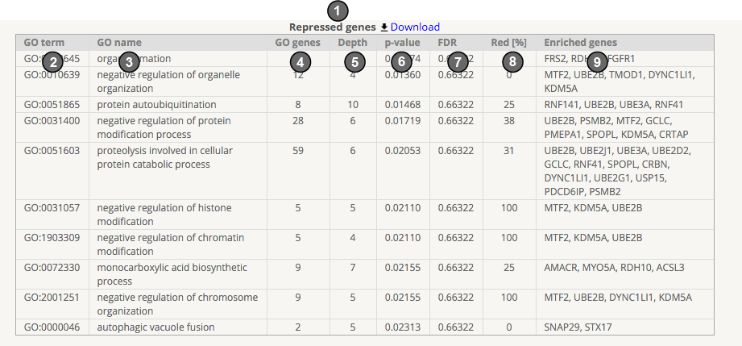

.. _go:

GO, Gene Ontology enrichment analysis
--------------------------------------
The target genes identified in the comparison of choice are used for a standard hypergeometric test of GO term enrichment. We use all polyA genes as the **reference
set** and perform 6 different enrichment analysis:

#. **Repressed genes**: list of all repressed genes (proximal site repressed, distal site enhanced) vs. reference set
#. **Enhanced genes**: list of all enhanced genes (proximal site enhanced, distal site repressed) vs. reference set
#. **Repressed proximal (protein bound) genes**: set of proximal bound repressed genes vs. reference set
#. **Enhanced proximal (protein bound) genes**: set of proximal bound enhanced genes vs. reference set
#. **Repressed distal (protein bound) genes**: set of distal bound repressed genes vs. reference set
#. **Enhanced distal (protein bound) genes**: set of distal bound enhanced genes vs. reference set

Top 10 results for each analysis is reported in table form:

#. name of the analysis
#. GO term identifier
#. GO term name
#. GO term number of genes assigned to it in the ontology
#. GO term depth (level)
#. p-value of the test
#. FDR corrected p-value
#. redundancy: how much of the enriched gene set did we already see in previous GO terms
#. set of enriched genes for the GO term

The entire results table can be downloaded in tab format (Download link at the top of the table).
